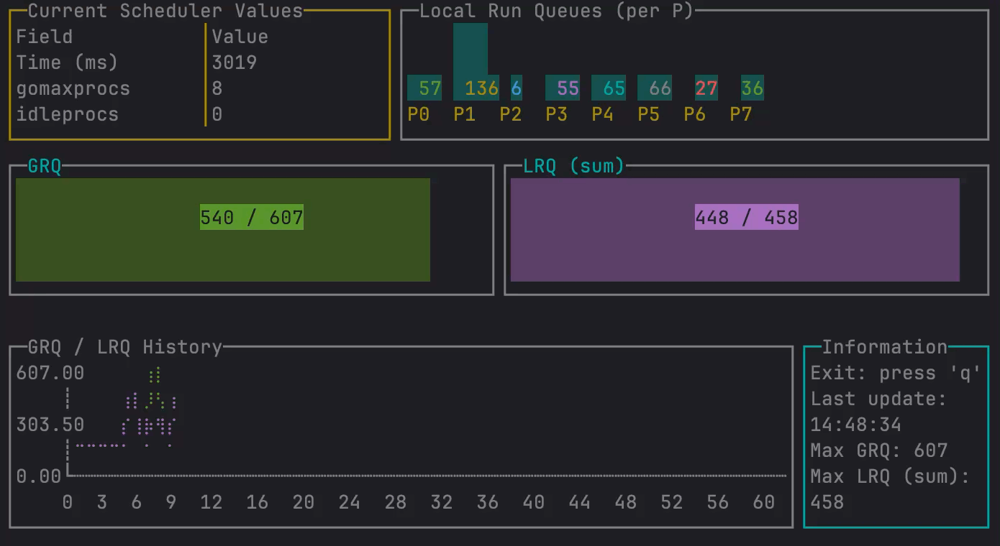

# goschedviz — Go Scheduler Visualizer

*Read this in other languages: [Русский](README.ru.md)*

A terminal-based visualization tool for the Go runtime scheduler. This tool helps understand Go's scheduler behavior by
providing real-time metrics visualization.



## Features

- Real-time monitoring of Go scheduler metrics using GODEBUG schedtrace
- Terminal UI with multiple visualization widgets:
    - Current scheduler values table
    - Local Run Queue bar chart
    - Global and Local Run Queue gauges
    - Historical metrics plot
- Support for any Go program as monitoring target

## Installation

### Option 1: From source

Clone and build the project:

```bash
git clone https://github.com/JustSkiv/goschedviz
cd goschedviz
make build
```

The binary will be created in the `bin` directory.

### Option 2: Using go install

```bash
go install github.com/JustSkiv/goschedviz/cmd/goschedviz@latest
```

This will install the `goschedviz` binary in your `$GOPATH/bin` directory. Make sure this directory is in your PATH.

## Usage

```bash
goschedviz -target=/path/to/your/program.go -period=1000
```

Where:

- `-target`: Path to Go program to monitor
- `-period`: GODEBUG schedtrace period in milliseconds (default: 1000)

### Controls

- `q` or `Ctrl+C`: Exit the program
- Terminal resize is supported

## Example

1. Create a simple test program (example.go):

```go
package main

import "time"

func main() {
	// Create some scheduler load
	for i := 0; i < 1000; i++ {
		go func() {
			time.Sleep(time.Second)
		}()
	}
	time.Sleep(10 * time.Second)
}
```

2. Run visualization:

```bash
goschedviz -target=example.go
```

Or try provided examples:

```bash
# Simple goroutines example
goschedviz -target=examples/simple/main.go

# CPU-intensive example
goschedviz -target=examples/simple2/main.go
```

## Understanding the Output

The UI shows several key metrics:

- **Current Values Table**: Shows current scheduler state including GOMAXPROCS, threads count, etc.
- **Local Run Queue Bars**: Visualizes queue length for each P (processor)
- **GRQ/LRQ Gauges**: Shows Global and total Local Run Queue lengths
- **History Plot**: Displays how queue lengths change over time

## How It Works

The tool:

1. Runs your Go program with GODEBUG=schedtrace enabled
2. Parses scheduler trace output in real-time
3. Visualizes the metrics using a terminal UI

## Requirements

- Go 1.23 or later
- Unix-like operating system (Linux, macOS)
- Terminal with colors support

## Development

```bash
# Build the project
make build

# Run tests
make test

# Clean build artifacts
make clean
```

## Author's Resources

- [YouTube Channel](https://www.youtube.com/@nikolay_tuzov) - Go programming tutorials
- [@ntuzov](https://t.me/ntuzov) - Main Telegram-channel: guides, news, announcements and more
- [@golang_digest](https://t.me/golang_digest) - Useful Go resources and materials

## Contributing

Contributions are welcome! Whether you're fixing bugs, improving documentation, or adding new features, your help is
appreciated.

If you're new to open source or Go development, this project is a great place to start. Check out
our [contribution guide](docs/CONTRIBUTING.md) for:

- Step-by-step instructions for making your first contribution
- Development environment setup
- Code style guidelines
- Types of contributions needed
- Community guidelines

Don't hesitate to ask questions - we're here to help you learn!

## Citation

If you use goschedviz in your project, research or educational materials, please consider mentioning or citing it:

```
This project uses goschedviz (https://github.com/JustSkiv/goschedviz) by Nikolay Tuzov
```

## License

MIT License - see [LICENSE](LICENSE) file for details.