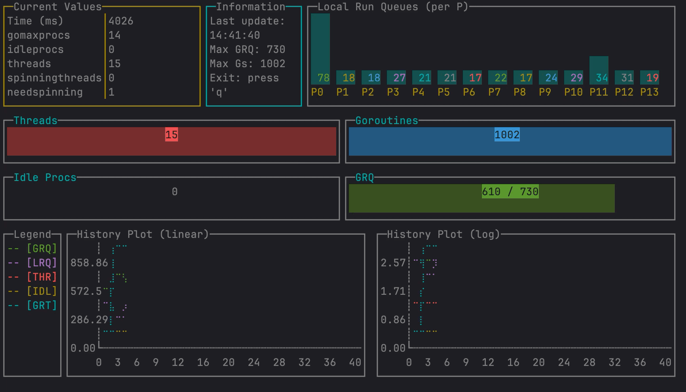

# goschedviz — Визуализация работы планировщика Go

[](https://github.com/JustSkiv/goschedviz/actions)
[](https://pkg.go.dev/github.com/JustSkiv/goschedviz)
[](https://goreportcard.com/report/github.com/JustSkiv/goschedviz)
[](https://github.com/JustSkiv/goschedviz/releases)
[](https://go.dev/doc/devel/release)
[](https://app.codecov.io/gh/JustSkiv/goschedviz)

[English version](../README.md)

Инструмент для визуализации работы планировщика Go в терминале. Помогает понять поведение планировщика Go через
отображение метрик в реальном времени.



⚠️ **Важно**: Этот инструмент предназначен только для образовательных целей. Он разработан для помощи в понимании работы
планировщика Go и не должен использоваться в продакшен-окружении или критически важных проектах. В нём могут быть ошибки
и он не оптимизирован для производительности.

## Возможности

- Мониторинг метрик планировщика Go в реальном времени с
  использованием [GODEBUG schedtrace](https://pkg.go.dev/github.com/maximecaron/gotraining/topics/profiling/godebug/schedtrace)
- Консольный интерфейс с несколькими виджетами:
    - Таблица текущих значений планировщика
    - Диаграммы локальных очередей (LRQ)
    - Индикаторы глобальной (GRQ) и локальных (LRQ) очередей выполнения
    - История значений метрик в виде графика
- Поддержка мониторинга любой Go-программы

## Установка

### Вариант 1: Из исходного кода

Клонируйте и соберите проект:

```bash
git clone https://github.com/JustSkiv/goschedviz
cd goschedviz
make build
```

Исполняемый файл будет создан в директории `bin`.

### Вариант 2: Используя go install

```bash
go install github.com/JustSkiv/goschedviz/cmd/goschedviz@latest
```

Это установит исполняемый файл `goschedviz` в директорию `$GOPATH/bin`. Убедитесь, что эта директория добавлена в PATH.

## Использование

```bash
goschedviz -target=/path/to/your/program.go -period=1000
```

Где:

- `-target`: Путь к Go-программе для мониторинга
- `-period`: Период GODEBUG schedtrace в миллисекундах (по умолчанию: 1000)

### Управление

- `q` или `Ctrl+C`: Выход из программы
- Поддерживается изменение размера терминала

## Пример

1. Создайте простую тестовую программу (example.go):

```go
package main

import "time"

func main() {
	// Создаем нагрузку на планировщик
	for i := 0; i < 1000; i++ {
		go func() {
			time.Sleep(time.Second)
		}()
	}
	time.Sleep(10 * time.Second)
}
```

2. Запустите визуализацию:

```bash
goschedviz -target=example.go
```

Или попробуйте готовый пример:

```bash
# Простой пример с интенсивной нагрузкой на CPU, GOMAXPROCS=2 и большим количеством горутин
goschedviz -target=examples/simple/main.go
```

Приветствуются новые интересные демонстрационные примеры. Особенно ценны примеры, показывающие различное поведение
планировщика (подробности в [Contributing](CONTRIBUTING.ru.md)).

Что могут продемонстрировать хорошие примеры:

- Нагрузку на CPU против I/O операций
- Различные конфигурации GOMAXPROCS
- Приложения с сетевой нагрузкой
- Операции с интенсивным использованием памяти
- Специфические паттерны работы планировщика или краевые случаи

Это помогает другим лучше понять поведение планировщика Go в различных сценариях.

## Понимание вывода

Интерфейс отображает несколько ключевых метрик:

- **Таблица текущих значений**: Показывает текущее состояние планировщика, включая GOMAXPROCS, количество потоков и т.д.
- **Столбцы локальных очередей**: Визуализирует длину очереди для каждого P (процессора)
- **Индикаторы GRQ/LRQ**: Показывают длины глобальной и суммарной локальной очередей
- **График истории**: Отображает изменение длин очередей во времени

## Как это работает

Инструмент:

1. Запускает вашу Go-программу с включенным GODEBUG=schedtrace
2. Анализирует вывод трассировки планировщика в реальном времени
3. Визуализирует метрики через терминальный интерфейс

## Требования

- Go 1.23 или новее
- UNIX-подобная операционная система (Linux, macOS)
- Терминал с поддержкой цветов

## Разработка

```bash
# Сборка проекта
make build

# Запуск тестов
make test

# Очистка артефактов сборки
make clean
```

## Ресурсы автора

- [YouTube канал](https://www.youtube.com/@nikolay_tuzov) - Туториалы по Go
- [@ntuzov](https://t.me/ntuzov) - Основной Telegram-канал: гайды, новости, анонсы и многое другое
- [@golang_digest](https://t.me/golang_digest) - Полезные материалы и ресурсы по Go

## Участие в разработке

Ваше участие приветствуется! Неважно, исправляете ли вы баги, улучшаете документацию или добавляете новые функции —
ваша помощь ценна для проекта.

Если вы новичок в open source или Go-разработке, этот проект отлично подойдет для старта. Рекомендую сначала
ознакомиться с [руководством по контрибьюту](CONTRIBUTING.md).

Не стесняйтесь задавать вопросы — это помогает вам учиться и развиваться ❤️

## Цитирование

Если вы используете goschedviz в своем проекте, исследовании или учебных материалах, пожалуйста, укажите ссылку:

```
Этот проект использует goschedviz (https://github.com/JustSkiv/goschedviz) от Николая Тузова
```

## Лицензия

MIT License — подробности в файле [LICENSE](LICENSE).

